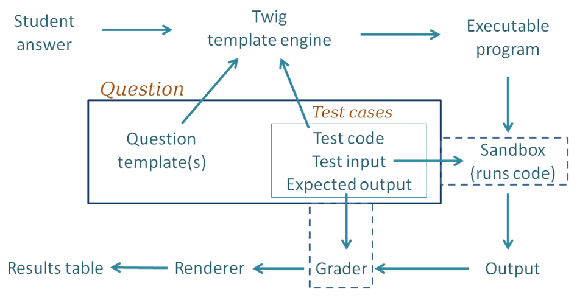

материал взят из репозитория [moodle-qtype_coderunner](https://github.com/trampgeek/moodle-qtype_coderunner)


# Архитектура coderunner



Шаги оценивания:

1. Для каждого из тестовых случаев шаблонизатор Twig объединяет представленный студентом ответ с шаблоном вопроса и кодом для данного конкретного тестового случая, чтобы получить исполняемую программу. Под "исполняемой" подразумевается программа, которая может быть выполнена, возможно, с предварительной компиляцией. 

1. Исполняемая программа передается в песочницу Jobe, которая компилирует программу (если необходимо) и запускает ее, используя стандартный ввод, предоставленный тестовым примером. 

1. Вывод от запуска передается в любой компонент Grader, который настроен, как и ожидаемый вывод, указанный для тестового случая. Наиболее распространенным грейдером является грейдер "точного совпадения", но доступны и другие типы. 

1. Результатом работы грейдера является "объект результата теста"("test result object"), содержащий (помимо прочего) атрибуты "Ожидаемый"("Expected") и "Полученный"("Got"). 

1. Описанные выше действия повторяются для всех тест-кейсов, в результате чего образуется массив объектов результатов теста (на рисунке не показаны в явном виде).

1. Все результаты теста передаются в рендер вопросов CodeRunner, который представляет их пользователю в виде таблицы результатов. Пройденные тесты отображаются зеленой галочкой, а проваленные - красным крестиком. Обычно вся таблица окрашивается в красный цвет, если какой-либо тест не прошел, или в зеленый, если все тесты прошли.


# Шаблоны

Расширение шаблона выполняется шаблонизатором Twig. Движку передается шаблон для рендеринга и набор предопределенных переменных, которые мы будем называть Twig Context. По умолчанию набор переменных контекста следующий:


- STUDENT_ANSWER - текст, который студент ввел в поле ответа.

- TEST - запись, содержащая тестовый пример. 

- IS_PRECHECK, имеет значение 1 (True), если шаблон оценивается в результате нажатия студентом кнопки Precheck, или 0 (False) в противном случае. 

- ANSWER_LANGUAGE, имеет значение только для многоязычных вопросов, для которых он содержит язык, выбранный студентом из выпадающего списка.

- ATTACHMENTS - список имен любых файлов, которые студент прикрепил к своей работе, разделенный запятыми.

- STUDENT - запись, описывающая текущего студента. 

- QUESTION, который представляет собой весь объект Moodle Question.

Использование {{ STUDENT_ANSWER | e(py) }} необходимо в тех случаях, когда студенческий код включается внутрь строкового выражения или встроенного блока кода.

### Пример работы шаблонов

Например студента попросили написать функцию int sqr(int n), которая возводит число n в квадрат. Тогда вопрос мог бы иметь следующий шаблон:

```c
    #include <stdio.h>
    #include <stdlib.h>
    #include <ctype.h>

    {{ STUDENT_ANSWER }}

    int main() {
        {{ TEST.testcode }};
        return 0;
    }
```

Этот шаблон был бы преобразован в:

```c
    #include <stdio.h>
    #include <stdlib.h>
    #include <ctype.h>

    int sqr(int n) {
        return n * n;
    }

    int main() {
        printf("%d\n", sqr(-9));
        return 0;
    }
```

так же подробнее про [Combinator templates](https://github.com/trampgeek/moodle-qtype_coderunner?tab=readme-ov-file#combinator-templates)


# Отладка шаблонов

При настройке шаблонов вопросов или разработке новых типов вопросов обычно полезно установить флажок Отладка шаблона и снять флажок Проверять при сохранении. Сохраните вопрос, а затем просмотрите его. При нажатии кнопки Check (или Precheck, если она включена) вам будет показан фактический код, отправленный в песочницу.


# Twig фильтры

Как объяснялось выше, синтаксис Twig {{ STUDENT_ANSWER | e('py') }} приводит к тому, что отправленное студентом сообщение фильтруется эскейп-функцией Python, которая экранирует все символы двойных кавычек и обратного слеша с добавлением обратного слеша. Python-эскейп e('py') - это только один из доступных эскейпов. Другие:

1. e('java'). При этом символы одинарных и двойных кавычек префиксируются обратным слешем и заменяются новыми строками, возвратами, форматированием, обратными пробелами и табуляциями в их обычной экранированной форме (\n, \r и т. д.).

1. e('c'). Это псевдоним для e('java').

1. e('matlab'). Экранирует одинарные кавычки, проценты и символы новой строки. Его следует использовать в контексте программы Matlab sprintf.

1. e('js'), e('html') для использования в JavaScript и html соответственно. Это встроенные модули Twig.


# Шаблон для типа вопроса, который компилирует и запускает представленную студентом программу на языке C.

```python
import subprocess, sys

# Write the student code to a file prog.c
student_answer = """{{ STUDENT_ANSWER | e('py') }}"""
with open("prog.c", "w") as src:
    print(student_answer, file=src)

# Compile

cflags = """{{ QUESTION.parameters.cflags | e('py') }}"""

cflags = "-std=c99 -Wall -Werror"

return_code = subprocess.call("gcc {0} -o prog prog.c".format(cflags).split())
if return_code != 0:
    print("** Compilation failed. Testing aborted **", file=sys.stderr)

# If compile succeeded, run the code. Since this is a per-test template,
# stdin is already set up for the stdin text specified in the test case,
# so we can run the compiled program directly.
if return_code == 0:
    try:
        output = subprocess.check_output(["./prog"], universal_newlines=True)
        print(output)
    except subprocess.CalledProcessError as e:
        if e.returncode > 0:
            # Ignore non-zero positive return codes
            if e.output:
                print(e.output)
        else:
            # But negative return codes are signals - abort
            if e.output:
                print(e.output, file=sys.stderr)
            if e.returncode < 0:
                print("Task failed with signal", -e.returncode, file=sys.stderr)
            print("** Further testing aborted **", file=sys.stderr)
```